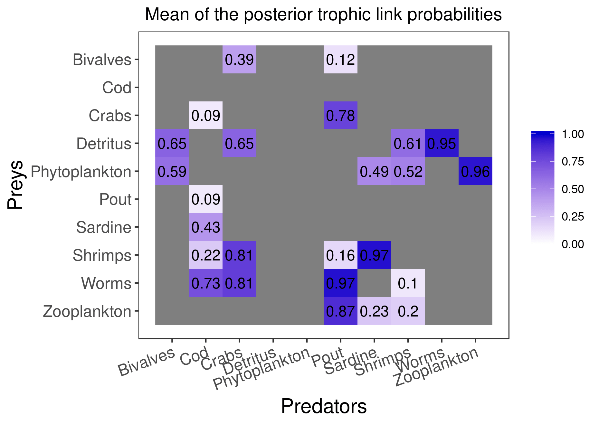
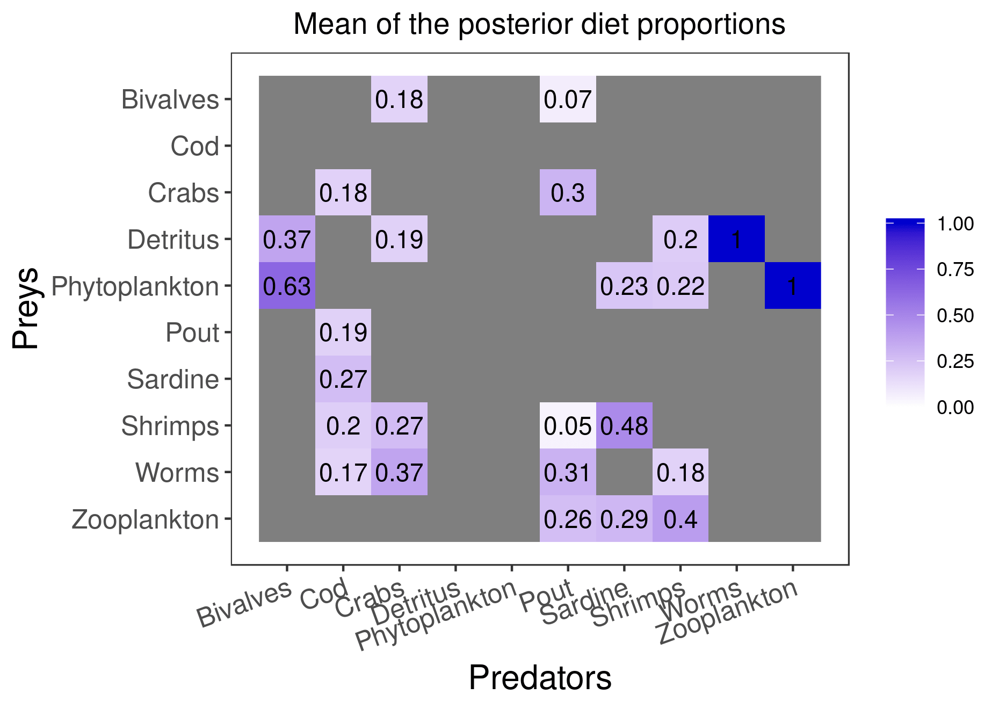
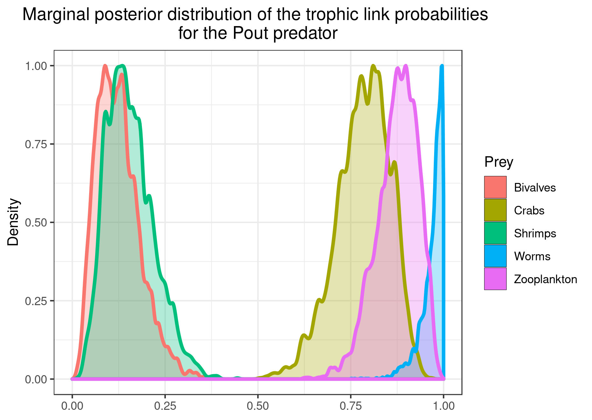
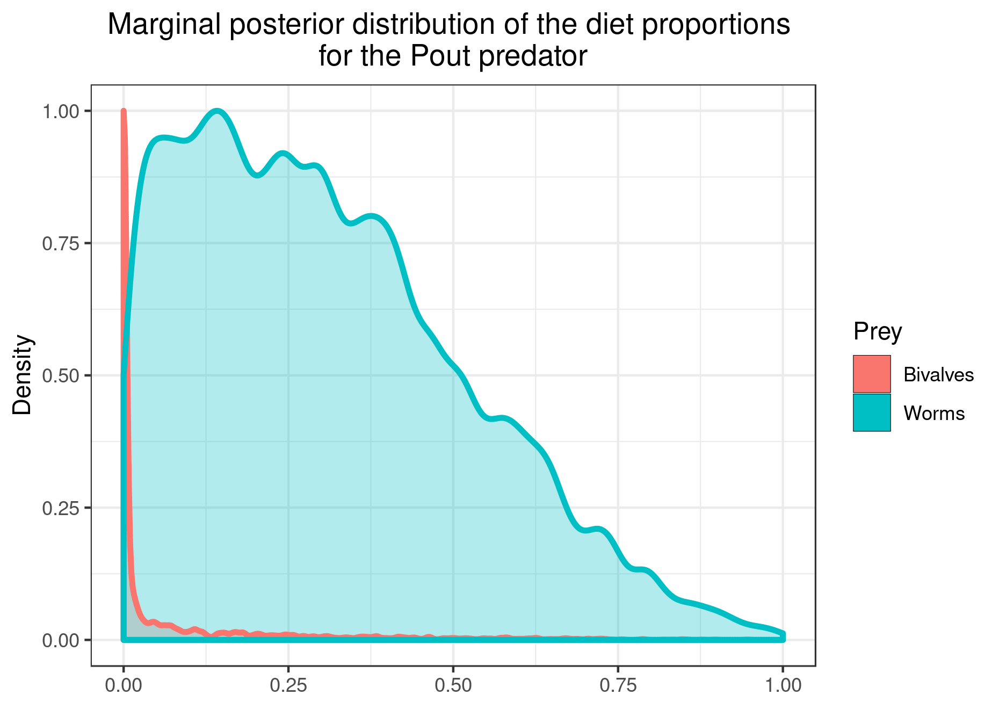
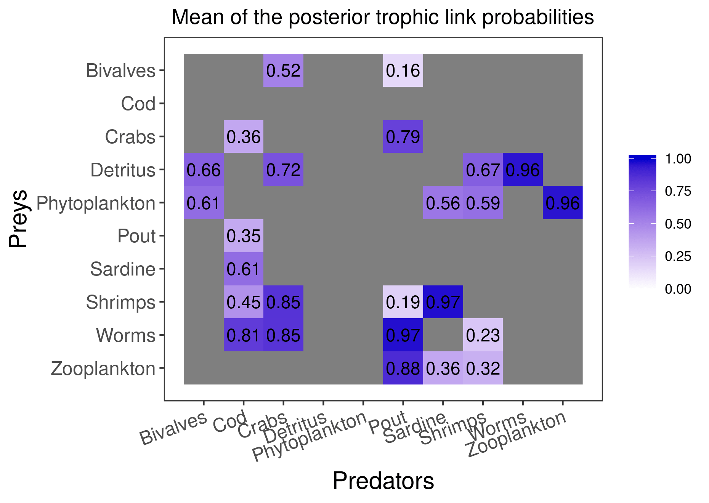
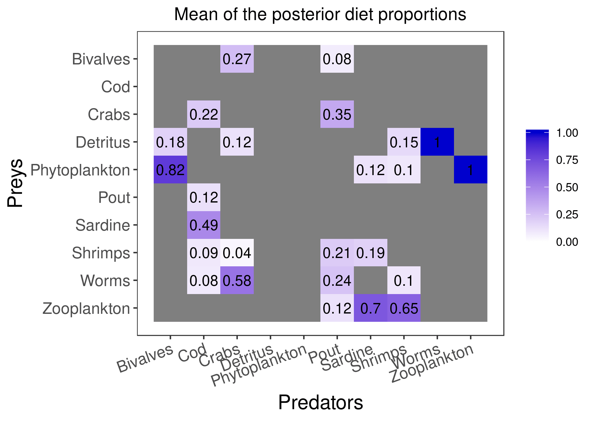
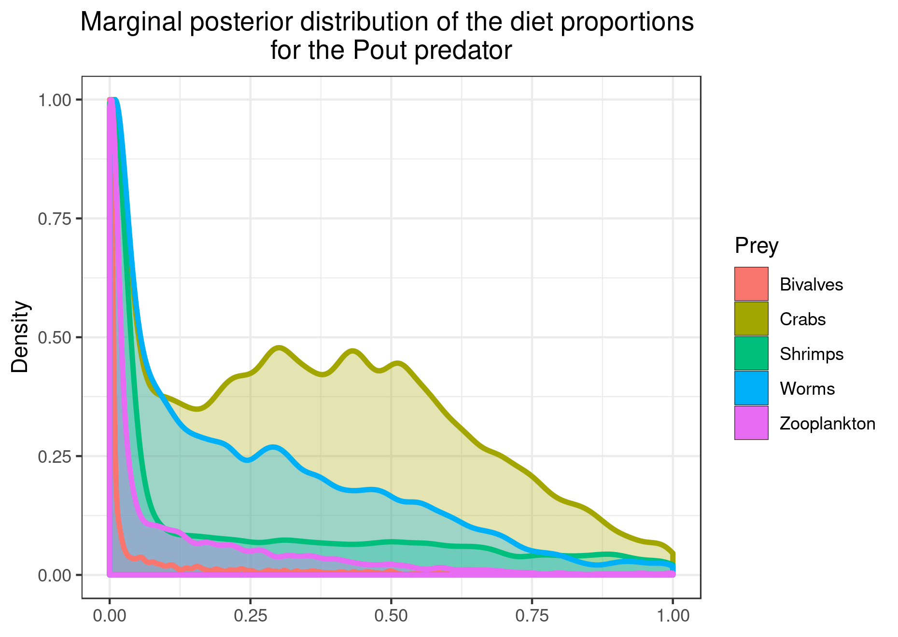

```{r, include = FALSE}
knitr::opts_chunk$set(
  collapse = TRUE,
  comment = "#>"
)
```

The introduction employed a simplistic expemple of food web to familiarize the user with the basic commands and options of the EcoDiet package. Here we will use a more realistic example (although still artificial!) to run the different EcoDiet configurations, compare their results and hence higlight the complementarity in the different data used. 

The data corresponds to 10 trophic groups with stomach content data, and very distinct isotopic measures.

```{r}
realistic_stomach_data_path <- system.file("extdata", "realistic_stomach_data.csv",
                                           package = "EcoDiet")
realistic_stomach_data <- read.csv(realistic_stomach_data_path)
knitr::kable(realistic_stomach_data)
```

```{r}
realistic_biotracer_data_path <- system.file("extdata", "realistic_biotracer_data.csv",
                                           package = "EcoDiet")
realistic_biotracer_data <- read.csv(realistic_biotracer_data_path)
knitr::kable(realistic_biotracer_data[c(1:3, 31:33, 61:63), ])
```

```{r, fig.height = 5, fig.width = 8, fig.align = "center"}
library(EcoDiet)

plot_data(biotracer_data = realistic_biotracer_data,
          stomach_data = realistic_stomach_data)
```

Yes, we are aware that isotopic data is usually messier, but isn't it a beautiful plot?

## The configuration without literature data

We define the configuration we are in, and preprocess the data:

```{r}
literature_configuration <- FALSE

data <- preprocess_data(biotracer_data = realistic_biotracer_data,
                        trophic_discrimination_factor = c(0.8, 3.4),
                        literature_configuration = literature_configuration,
                        stomach_data = realistic_stomach_data)
```

In this configuration, priors are set for each trophic link identified as plausible by the user but the priors are not informed by literature data, and are thus uninformative:

```{r, fig.height = 5, fig.width = 8, fig.align = "center"}
plot_prior(data, literature_configuration)
```

The marginal prior distributions have different shape depending on the variables:

* it is flat or uniform for $\eta$, the probabilities that a trophic link exists (all the probabilities of existence are thus equiprobable),

* the marginal distributions for each diet proportion $\Pi$ are peaking at zero, although the joint distribution for $\Pi$s is a flat Dirichlet prior, because all the diet proportions must sum to one.

```{r, fig.height = 5, fig.width = 8, fig.align = "center"}
plot_prior(data, literature_configuration, pred = "Pout")
```

We define the model, and test if it compiles well with a few iterations and adaptation steps:

```{r}
model_string <- write_model(literature_configuration = literature_configuration)

mcmc_output <- run_model(textConnection(model_string), data, nb_adapt = 1e1, nb_iter = 1e2)
```

You should now try to run the model until it converges (it should take around **half an hour** to run, so we won't do it in this vignette):
```{r, eval = FALSE}
mcmc_output <- run_model(textConnection(model_string), data, nb_adapt = 1e3, nb_iter = 1e5)
```

Here are the figures corresponding to the results that have converged:

```{r, eval = FALSE}
plot_results(mcmc_output, data)
```

{width=700}

{width=700}


```{r, eval = FALSE}
plot_results(mcmc_output, data, pred = "Pout")
```

{width=550}

{width=550}

You can also plot the results for specific prey if you want a clearer figure:
```{r, eval = FALSE}
plot_results(mcmc_output, data, pred = "Pout", 
             variable = "PI", prey = c("Bivalves", "Worms"))
```

{width=550}

## The configuration with literature data

We now change the configuration to add literature data to the model:
```{r}
literature_configuration <- TRUE
```

```{r}
realistic_literature_diets_path <- system.file("extdata", "realistic_literature_diets.csv",
                                               package = "EcoDiet")
realistic_literature_diets <- read.csv(realistic_literature_diets_path)
knitr::kable(realistic_literature_diets)
```

```{r}
data <- preprocess_data(biotracer_data = realistic_biotracer_data,
                        trophic_discrimination_factor = c(0.8, 3.4),
                        literature_configuration = literature_configuration,
                        stomach_data = realistic_stomach_data,
                        literature_diets = realistic_literature_diets,
                        nb_literature = 12,
                        literature_slope = 0.5)
```

Now we see that the prior distributions are informed by the literature data:

* when the literature diet input is > 0, the trophic link probabilities $\eta$ are shifted toward one. Here this is the case for all prey but we could imagine that the user identify a species as a plausible prey whereas it has not been observed being consumed by the predator in the literature. In that case, the literature diet of 0 would drive $\eta$ toward 0.

* the average prior for the diet proportions $\Pi$ is directly the literature diet input.

```{r, fig.height = 5, fig.width = 8, fig.align = "center"}
plot_prior(data, literature_configuration)
```

```{r, fig.height = 5, fig.width = 8, fig.align = "center"}
plot_prior(data, literature_configuration, pred = "Pout")
```

Again, we verify that the model compiles well:

```{r}
model_string <- write_model(literature_configuration = literature_configuration)

mcmc_output <- run_model(textConnection(model_string), data, nb_adapt = 1e1, nb_iter = 1e2)
```

You should now try to run the model until it converges (it should take around **half an hour** to run, so we won't do it in this vignette):
```{r, eval = FALSE}
mcmc_output <- run_model(textConnection(model_string), data, nb_adapt = 1e3, nb_iter = 1e5)
```

Here are the figures corresponding to the results that have converged:

```{r, eval = FALSE}
plot_results(mcmc_output, data)
```

{width=700}

{width=700}

```{r, eval = FALSE}
plot_results(mcmc_output, data, pred = "Pout")
```

{width=550}

{width=550}

You can save the figures as PNG using:

```{r, eval = FALSE}
plot_results(mcmc_output, data, pred = "Pout", save = TRUE, save_path = ".")
```
